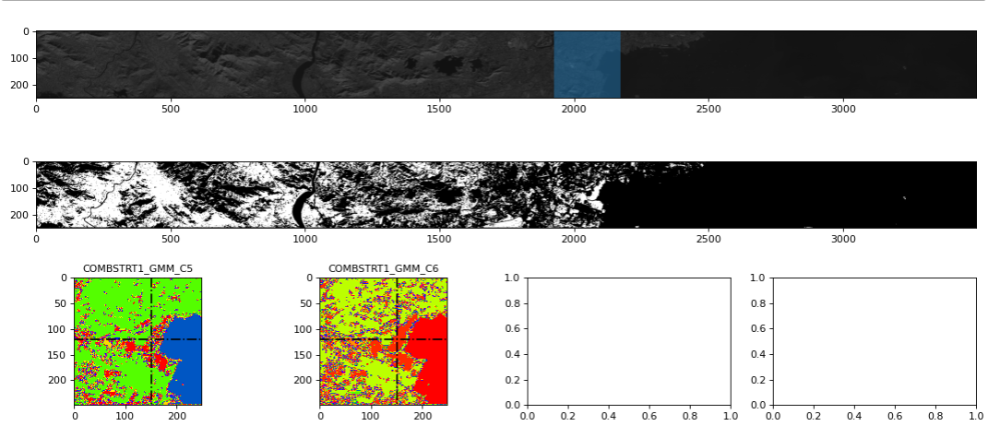

# pyHSI
Utilities for Hyperspectral Imagery

**Before proceeding with the download the data from  [here](https://drive.google.com/file/d/1TmaE-MyEgzrVrr3egM-G9pBLXobConIf/view?usp=sharing) and place the zip file in the raw_data folder**

### Beach Areas

### Dense Urban Population

### Water Bodies

### Unhabited Plains

****

## Spectral Analysis
****

## Clustering Analysis
****

